# LIS 4368

## Kalecia McNeal

### Project 2 Requirements:

*This includes:*

1. Fix validation for required files
2. Edit README.md
3. Provide required screenshots 
4. Answer questions from Ch 16 and 17. 

#### README.md file should include the following items:

* Screenshot of validation
* Screenshot of passed validation
* Screenshot of displaying data 
* Screenshots of modifying data 
* Screenshot of delete warning 
* Screenshots of associated database changes 

#### Assignment Screenshot and Links:

*Screenshot of valid entry form*:
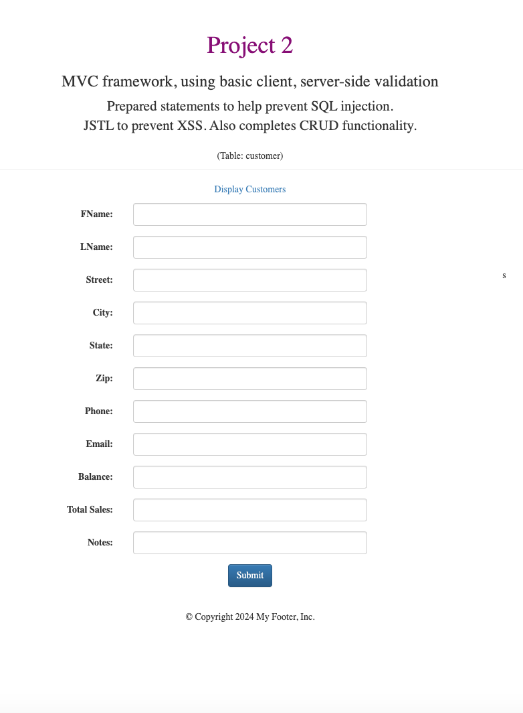

*Screenshot of passed validation*:
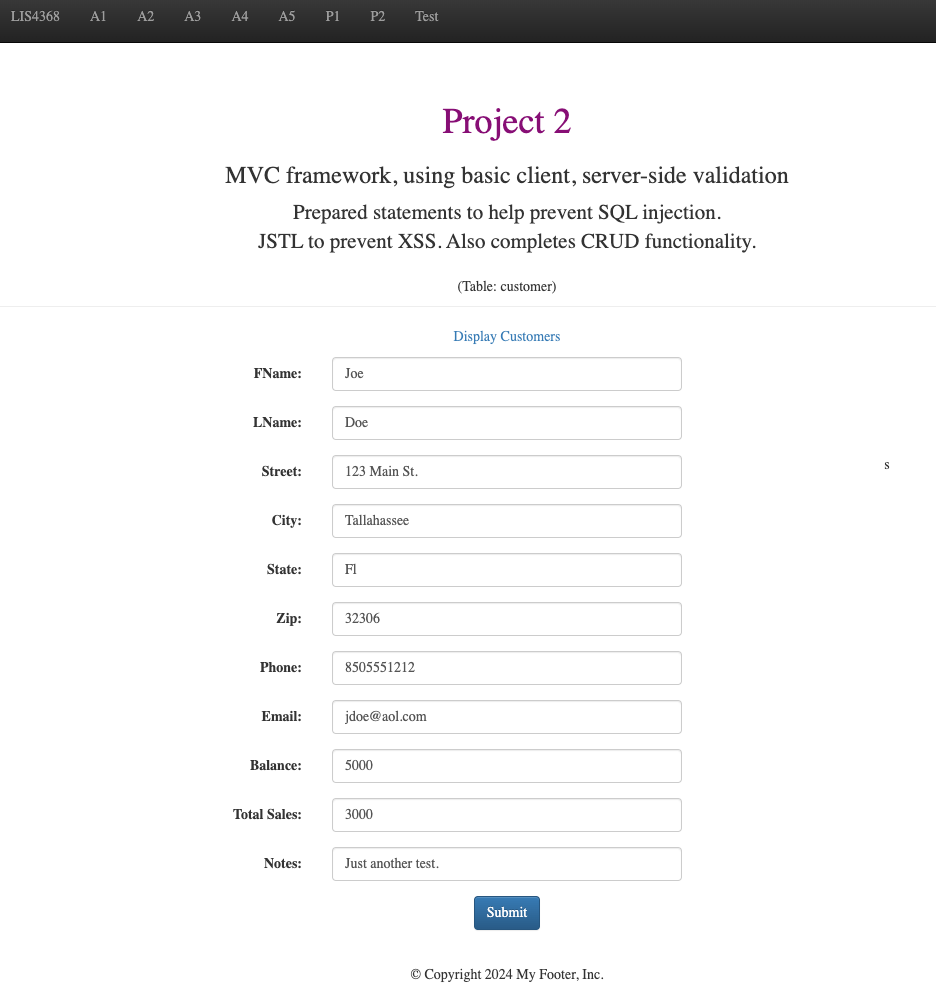

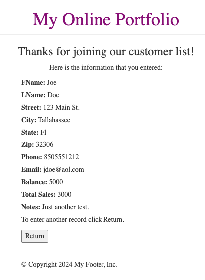

*Screenshot of displaying data*:
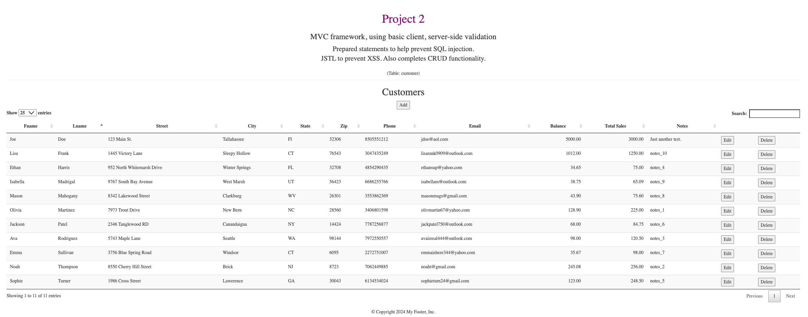

*Screenshot of modifying form*:
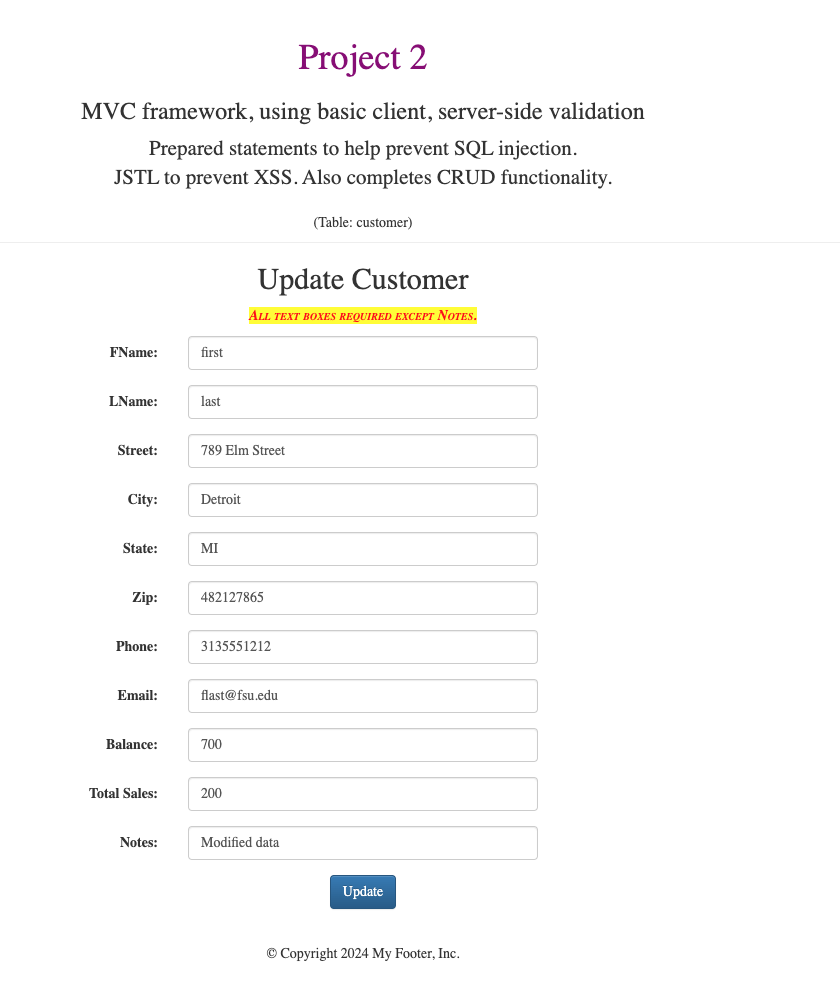

*Screenshot of modified data*:
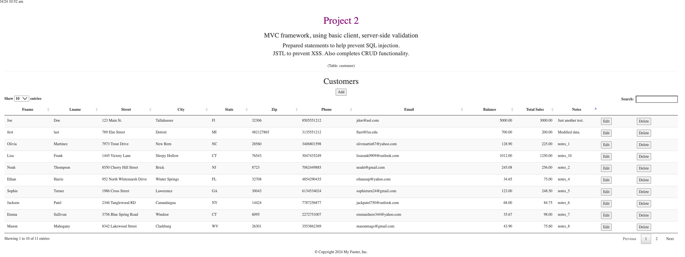

*Screenshot of delete warning*: 
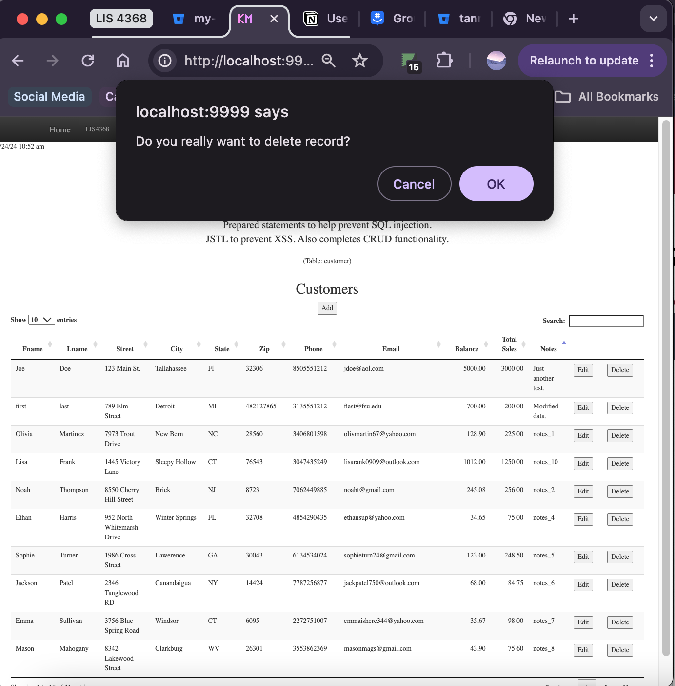

*Screenshot of associated database changes (select, insert, update and delete)*: 

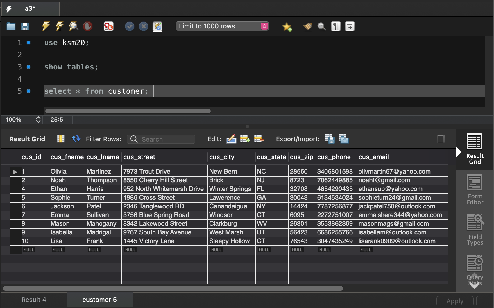

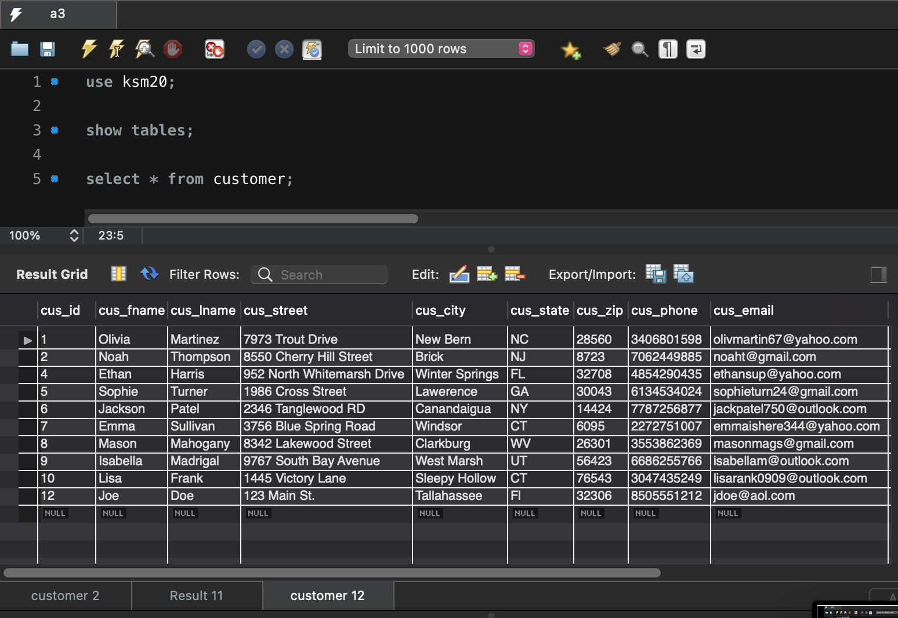

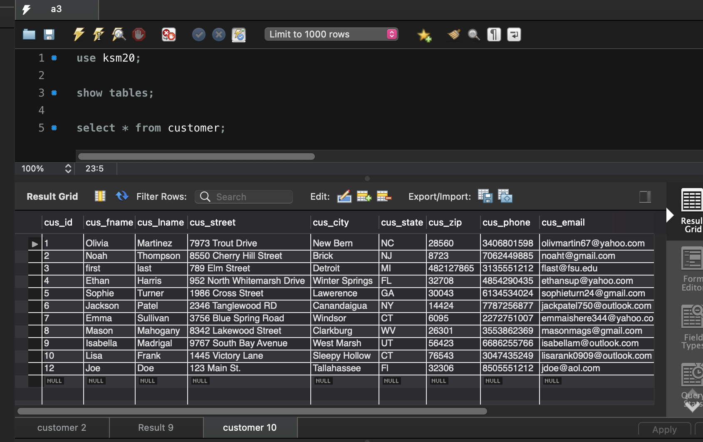

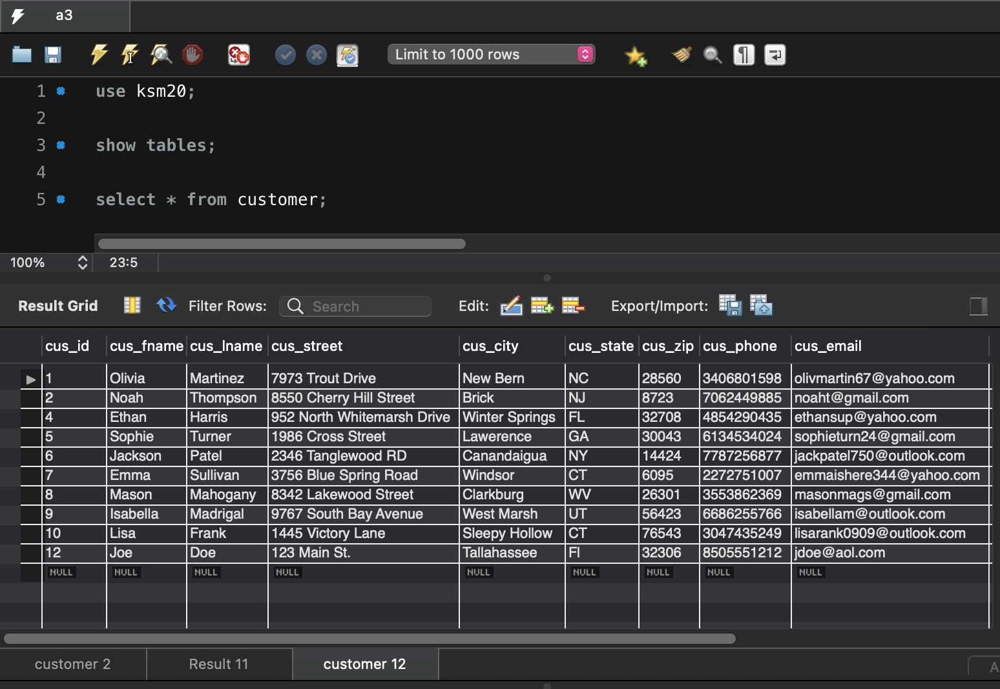
